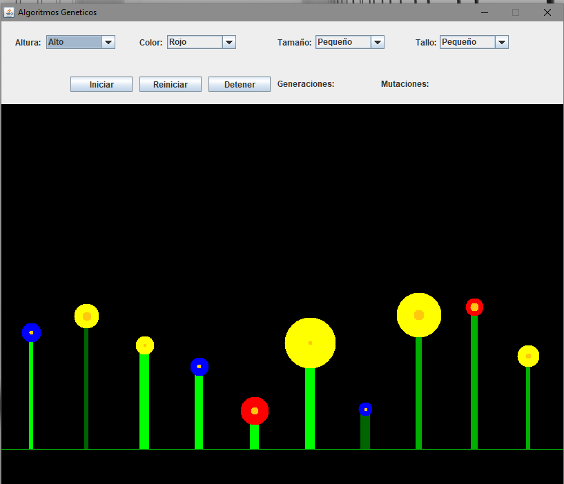
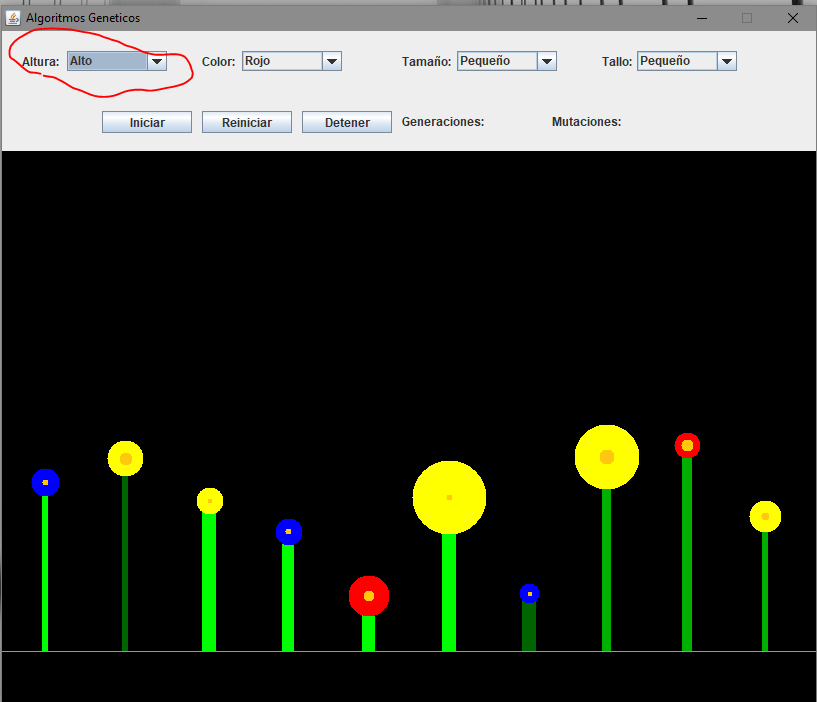
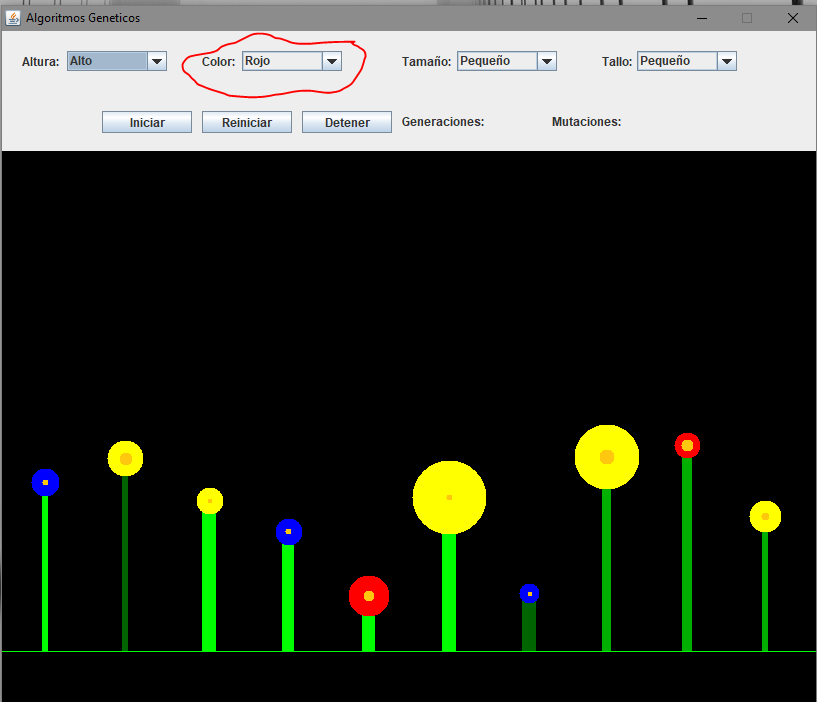
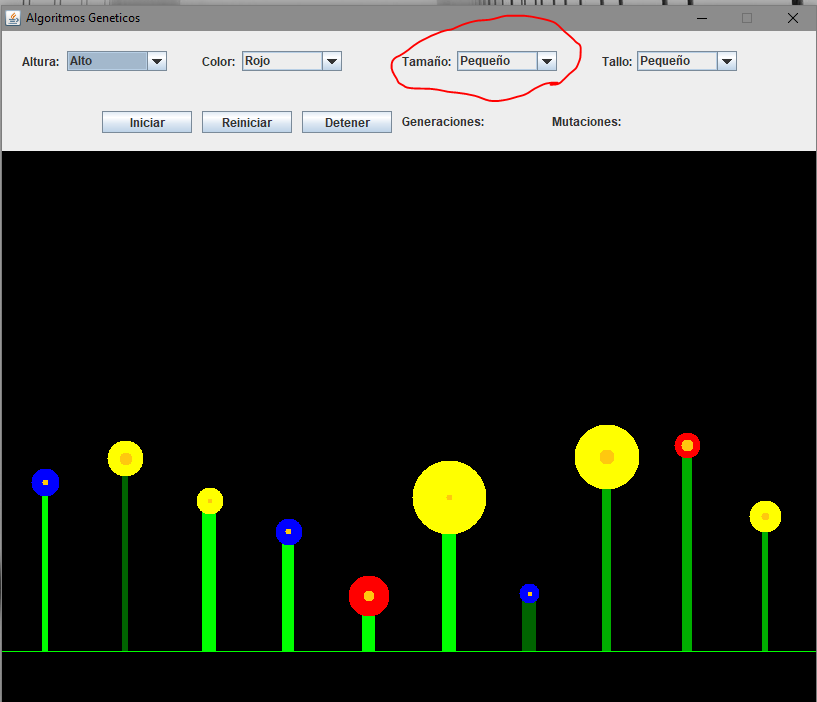
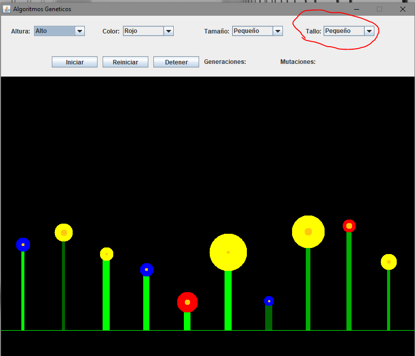

# AlgoritmosGeneticos
Programa de algoritmos genéticos, en el se obtiene la mejor opción seleccionada por el usuario.

## Funciones
El software sirve para hacer seleccion natural de unas floren que se generan de forma aleatoria, segun sean las opciones que el usuario ponga sera lo que el programa busque.

Las siguientes son las opciones que se pueden utilizar en el programa.

- **Altura** 

- **Color** 

- **Tamaño** 

- **Tallo** 

